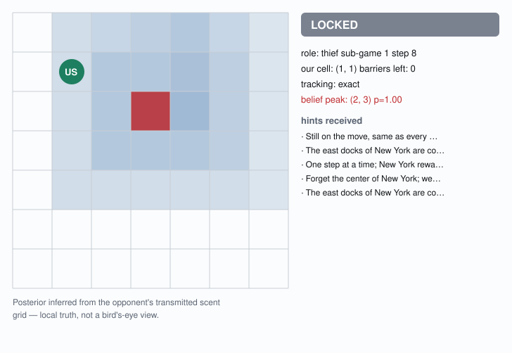
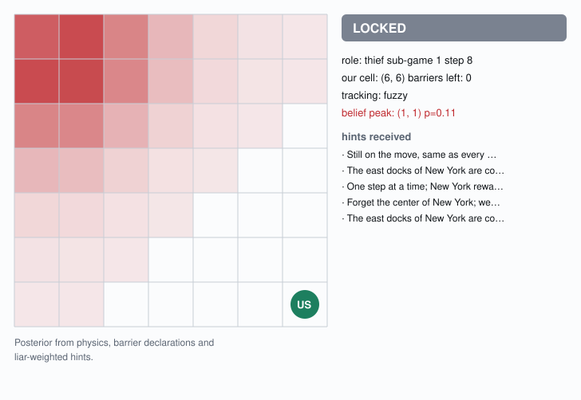
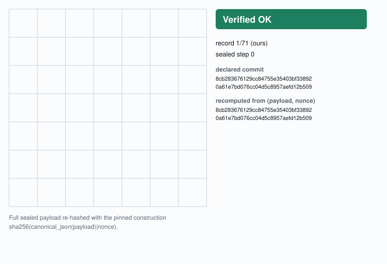
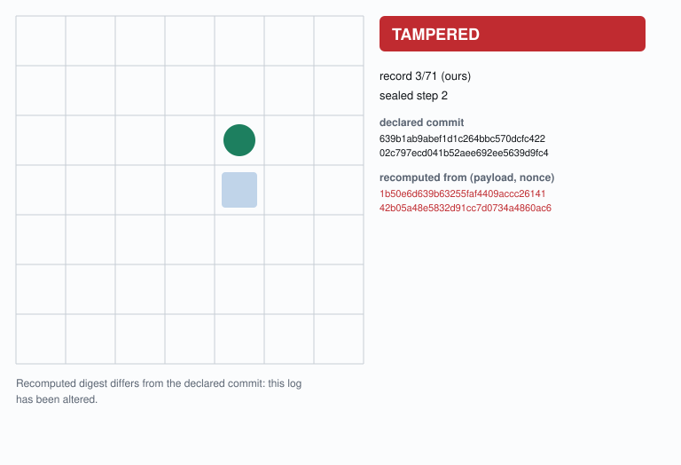

# COSMOS77-thief — Distributed Cops-and-Robbers over a P2P Network

**Team `cosmos77` · Tasneem Natour · Abdallah Khaldi**
Final project, *Orchestration of AI Agents* (203.3763, Dr. Yoram Segal, University of Haifa).

The **thief half** of a two-agent league player. Two fully separate processes in two separate
repositories negotiate a signed constitution, play a six-sub-game series over FastMCP against
another team's agents, seal every move under SHA-256 commit–reveal, audit each other's logs, and
each independently email one machine-readable result.

**Sister repository — the cop half:
[COSMOS77-cop](https://github.com/AbdallahKhaldi/COSMOS77-cop).**
The two never share memory, a process, or a module holding live state; only the stateless
`protocol/` package is vendored byte-identically in both (a test asserts the trees hash equal).

Interoperability is measured, not assumed: every hash is checked against the community league kit
([Imreec/copthief-league-protocol](https://github.com/Imreec/copthief-league-protocol)) and full
series are played against its independent sparring peer — see
**[docs/SPARRING.md](docs/SPARRING.md)**.

---

## Live (arena era)

Our permanent public home: **https://cosmos77-arena-production.up.railway.app** — live 3D local-truth viewer, replay cinema with per-step
`Verified OK`, public challenge page, challenger docs, league ledger. This agent's canonical league
endpoint: `https://cosmos77-arena-production.up.railway.app/thief/mcp` (single-URL opponents dial `https://cosmos77-arena-production.up.railway.app/mcp`). Compatibility self-test for
any team: the doctor card on `https://cosmos77-arena-production.up.railway.app/docs`, or locally `uv run cosmos-thief doctor --json --url …`.

**What each surface may show (rules 8–9).** Every *live* surface — the Tkinter window, the arena's
3D live page, the local `console/` ops panel — renders ONE agent's local truth: our cell, the
barriers we have seen declared, the scent we perceive, and the opponent only as a labelled
BELIEF. The **bird's-eye view exists solely in the replay cinema, after a game has settled**: its
frames are rebuilt from the sealed logs both sides revealed at audit and re-verified per step
(`Verified OK` / `TAMPERED`), which is the rule-20 artifact itself. Rules 8–9 govern the *live*
interface — rule 8 says "the **live** user interface must display local truth only", rule 9 "never
display the full objective board state in the **live** UI" — and the reasoning for reading them
that way, including why the opposite reading would make rule 20 unsatisfiable, is recorded as
**ADR-009** in [docs/DECISIONS.md](docs/DECISIONS.md).

## 1. The model: a Dec-POMDP, and why ours is nearly observable

### 1.1 The formal model

The pursuit is a **decentralised partially-observable Markov decision process**. Two agents act
without a referee, each holding a private observation history:

| Element | This game |
|---|---|
| State `s` | `(cop cell, thief cell, barrier set, step, barrier quota)` on a 7×7 grid, `(row, col)`, origin top-left |
| Actions `A` | `{N, S, E, W, STAY}`; the cop may instead **place a barrier** on its own cell or an open 4-neighbour, which *replaces* its move |
| Transition | Deterministic. Thief moves first; barriers are permanent and block both agents |
| Observation `o` | The opponent's transmitted **scent grid**, its free-language **hint** (≤15 words, may lie), its **barrier declarations** (public and truthful by rule 15), and answers to capture claims |
| Reward | Capture: cop 20 / thief 5. Survival to 35 steps: thief 10 / cop 5. Timeout, technical loss or tamper forfeit: 0/0 to both — a *sanction*, not a tie |
| Horizon | 35 thief moves per sub-game; 6 sub-games per series, roles alternating |

What makes it a *Dec*-POMDP rather than two independent POMDPs is that neither agent may consult a
shared world model: our engine is only ever fed our own position, and every fact about the
opponent must arrive as a message.

### 1.2 Our contribution: the observation channel is invertible

The book presents the scent field as a source of *fuzzy* belief, and most implementations treat it
that way. Under the reference model `subtractive_chebyshev_v1` it is not fuzzy at all.

Each agent deposits intensity `0.9` at its own cell, falling off `0.3` per Chebyshev ring, and the
whole trail decays only `0.1` per step. The fresh deposit is therefore **three decay-steps brighter
than anything stale**, so

```
argmax(received grid) = the emitter's current cell
```

is exact, not probable. The kit measured this at 224/224 frame pairs. We measured it again over
real HTTP against an implementation we did not write: **159/159 steps at offset 0**, across three
six-window series (`scripts/calibrate_tracker.py`).

The consequence is the strategic core of this project. Against a peer using the reference model the
Dec-POMDP **collapses to a full-information alternating-move pursuit game** — small enough
(≤ 49·49·2 = 4802 states per barrier configuration) to *solve exactly* rather than approximate. Our
tracker publishes a `confidence` flag: when it says `exact`, the solver drives; when it says
`fuzzy`, a physics-constrained belief map does.

### 1.3 The limit of that contribution — measured, not hand-waved

Exact inversion is a property of *that* model, not of scent in general. Against the kit's
`multiplicative_book_v1` peer the grid still arrives but does **not** invert: its true cell sat
still for six turns while our argmax wandered across the board. Trusting it handed our brain a
*confidently wrong* position and cost us a series 30–90. We now gate exact mode on the pair-locked
scent model, and the same matchup settles 47–47 (45–45 before the series_add tie bonus).

A confidently wrong observation is worse than a declared unknown. That is the single most useful
thing this project taught us, and it is [ADR-005](docs/DECISIONS.md).

### 1.4 A second exact channel that is easy to miss

Rule 15 makes every barrier placement **public and truthful**, and a placement is only legal on the
placer's own cell or one of its 4-neighbours. So a declared barrier pins the opponent inside a
five-cell set — and because placement *replaces* movement, the placing agent did not move that
turn, so the belief must not diffuse. Our thief's belief layer exploits both facts, which is what
lets it hold the survival floor even with no usable scent.

---

## 2. Orchestration over FastMCP: the dilemmas and what we chose

There is no server, no referee and no shared clock. Both peers run an MCP server *and* dial the
other. Every decision below was forced by a failure we actually hit.

**Turn management without a referee.** The wire carries `TurnMessage`s; the *game* advances only
when the receiver contract says a message is applicable. Turn order (thief first) is **not** covered
by any protocol lock — two peers can agree on every declared hash and still deadlock into mutual
timeouts — so we state it in the first-contact message and assert it in the driver.

**Handlers must never block.** All four tools (`negotiate`, `receive_turn`, `receive_control`,
`submit_audit`) validate, enqueue, and return `{"ok": true}` immediately; the game loop runs on a
worker thread. Two peers awaiting each other inside handlers is an instant deadlock. A refusal can
therefore never be a return value — it travels back as a `ControlMessage`. The argument-name
asymmetry is load-bearing: `submit_audit` takes `payload`, the other three take `message`.

**HTTP is at-least-once, so duplicates arrive by design.** A correct client retries an unacked push.
Our receiver dedupes on the **commit**, never on `(kind, step)` — collapsing those would silently
hide *equivocation* (a different commit for a step already played), which is tampering evidence and
must stay loud. The reorder window *is* the flood rule. Fault injection (duplicate-everything,
reorder-within-window, drop-and-retry, combined chaos) must produce a **byte-identical applied
ledger**, and does.

**One clock per expected message.** Tolerated traffic never renews a deadline — otherwise a stalling
peer could hold us forever by sending noise — and the deadline is evaluated on *every* loop lap,
because a receiver that only checks its clock on an empty poll never checks it under a flood.

**The Orchestrator and Gatekeeper patterns.** `orchestrator/gateway.py` is the single construction
site for every subsystem; a state machine rejects illegal transitions outright; a watchdog performs
one controlled rescue on a stall. Every outbound email passes a Gatekeeper enforcing a daily quota,
a token bucket (`tokens = min(C, tokens + r·Δt)`, whose refill rate *derives* from the signed
`requests_per_minute` so the opponent can see it), and a DOS lock, answering a 429 with exponential
backoff rather than a blind resend.

**Sequencing across windows.** Sub-game *N* launches only after *N−1*'s log file exists, every window
gets a completely fresh runtime (engine, scent, tracker, nonce stream, handshake), and only the
transport survives. Building this surfaced two deadlock classes worth recording: a drain that ate an
early greeting, and a single-shot handshake that could not recover from one lost message. Greetings
are idempotent, so we re-greet on a cadence and never discard one.

---

## 3. Strategy — including the part that says we cannot always win

### 3.1 The game-theoretic ground truth

**The bare 4-neighbour 7×7 grid is not cop-win for a single cop.** The 4-cycle `C4` is a retract of
the grid graph and `c(C4) = 2`, so the cop number is at least 2. Our retrograde solver returns ∞
from the standard start — and that is the *correctness check*, not a bug. Two consequences run
through the whole design:

- **Our thief's 35-step survival is a provable floor, not a hope.** Playing the solver's evasion it
  holds the invariant "end every move at graph distance ≥ 2 from the cop" indefinitely. Property
  tests assert survival against greedy, random and solver-optimal cops, and a full-stack test
  asserts it end-to-end through the wire, the audits and settlement.
- **Our cop's win has to be *constructed*.** Capture comes from graph surgery: barriers that shrink
  the thief's reachable region until the solver's value becomes finite.

### 3.2 The retrograde solver

Backward induction over `(cop, thief, side-to-move)` for a given barrier set, with an **enlarged
capture set**: with the cop to move, a thief on an adjacent open cell is already lost, because the
cop can step onto it *or* drop a rule-46 barrier on it. Cells with no open neighbour are rule-47
terminals. The solve is memoised per barrier configuration and completes in well under 100 ms, so it
can be recomputed after each of the ≤14 placements. Technique ported from our HW6 pursuit solver and
re-derived for the orthogonal, barriered, thief-win board.

### 3.3 The cop's two regimes

Placement itself cannot go inside the solver — an action space including "place any legal barrier"
is infeasible — so it is a heuristic layer above it, in two regimes:

- **Finishing.** If some placement makes the solver's value finite *and* reachable within the
  remaining step budget (counting the free move the thief gets while we place), take it. Otherwise
  pursue the solver line.
- **Building.** While the value is ∞, herd the thief outward and place barriers that cut its
  reachable region by a meaningful margin. Two rules earn their keep: never gate this regime on
  `steps_to_capture` (it is ∞ *by definition* here, which would block every first wall), and **never
  choose a cut that seals us out of the thief's component** — that hands the thief a guaranteed
  survival however much area it removes.

Against the kit's greedy evader this converts from five different starts, within 25 moves and inside
the quota, frozen as a regression test.

### 3.4 Degraded mode, and the hint layer

With no usable scent the belief map carries the load: it starts as a delta at the opponent's declared
start, diffuses one legal step per opponent move, and conditions on barrier declarations (hard, §1.4)
and hint directions (soft, weighted by a running per-opponent **liar score** calibrated against
scent-derived truth). Hints from a caught liar converge to near-zero weight.

**The LLM never decides a move.** Gemini writes hint *text* only — ≤15 words, coordinate-free (we ban
digits outright), with the sealed `intent` flag set truthfully to `truth` or `lie`, because a bluff
recorded as truth is tampering. Any failure of any kind falls back to a zero-token template pool,
which is what guarantees every sub-game finishes.

### 3.5 Why no reinforcement learning

The rulebook offers RL as one option among heuristics and LLM policies. We did not use it, and the
reason is not squeamishness: **a solved sub-game strictly dominates a learned policy here.** The
state space per barrier configuration is 4802 — small enough for exact backward induction in
milliseconds — so a learned approximation could at best converge *towards* the answer we already
compute exactly, while adding sample cost, non-determinism and an unfalsifiable failure mode. RL
would earn its place if the observation were genuinely fuzzy *and* the state space were large; §1.2
removes the first condition and the board size removes the second. Where uncertainty is real
(degraded mode) we use an explicit Bayesian posterior, which we can inspect, test and draw.

---

## 4. Integrity: commit–reveal and the audit

Every step is sealed as `commit = SHA256(canonical_json(payload) + "|" + nonce)` — the nonce is
pipe-appended **outside** the JSON and stays secret until the end-of-game reveal. Canonical form is
`sort_keys=True, ensure_ascii=False, separators=(",", ":")`; `ensure_ascii=False` is the single most
load-bearing detail in the protocol, because the opponent re-hashes our revealed Hebrew and emoji
hints with *its own* serializer. The release publishes three mutually inconsistent commit
constructions; we implement the reference form, and our tests assert the other two produce different
digests.

The end-of-game audit runs four layers, keeping its verdicts separate so an honest opponent is never
sent hunting a serialization bug it does not have:

1. **Integrity** — every revealed record re-hashes to its own commit → `TAMPERED`.
2. **Binding** — every commit received during play must equal the revealed one, and every received
   step must be revealed. (Pure self-consistent re-hashing cannot catch a wholesale re-forged log.)
3. **Physics** — replayed from the revealed *position trail*, never from the peer's move-token
   spelling: on-board, ≤1 orthogonal step, quota, step ceiling → `ILLEGAL`.
4. **Corroboration** — a rule-46/47 ending is visible only to the thief, so it must be *said* on the
   wire; the cop then corroborates it against its **own** barrier record and the trail's end. A
   `caught: true` is never simply believed.

Settlement follows one rule: audits exchanged and clean → the played outcome stands; exchanged and
failed → tamper forfeit; no audit on a zeroed outcome → a settled technical-loss row; **no audit on a
played outcome → nothing is settled, no result artifact exists, and nothing is emailed** — while all
six sub-games are still played out.

---

## 5. Screenshots

**Live view — local truth only (rules 8–9).** Our cell (green), the barriers we have seen declared,
the scent field we perceive (blue), and our posterior over the opponent (red). The opponent's true
position is never an input to this window; even with exact tracking it renders as a belief of 1.0,
which is an *inference* from the grid they transmitted. Tests assert that no GUI module can even
reach the rival's position.

| Exact tracking (scent inversion) | Degraded / belief mode (`multiplicative_book_v1`) |
|---|---|
|  |  |

**Replay viewer — per-step verification (rule 20).** Each revealed record is re-hashed with the FULL
sealed-payload construction; the book's simplified `nonce|move` sketch does not reproduce a real
commit, and the viewer catches that too.

| A clean log | The same log, one byte changed |
|---|---|
|  |  |

---

## 6. Running it

```bash
uv sync                                   # Python 3.12; uv only
make test                                 # pytest, coverage >=85% enforced
make lint                                 # ruff, zero-violation policy
make smoke                                # two real processes: handshake + one committed turn

uv run cosmos-thief selfplay                # full 6-window series vs the sibling repo (two processes)
uv run cosmos-thief selfplay --gui          # ...with the live window on BOTH agents
uv run cosmos-thief console                 # local ops panel in your browser (pairing, runs, status)
uv run cosmos-thief replay <log.json>       # step through, Verified OK / TAMPERED per record
uv run cosmos-thief report <result.json>    # dry run by default; --counted --send to arm
uv run cosmos-thief compare ours.json theirs.json    # the report-compare ritual
uv run cosmos-thief doctor                  # local health
uv run cosmos-thief kill                    # free our port (orphaned peers keep playing)

uv run python scripts/sparring_exam.py --label demo    # a full series vs the community kit peer
uv run python scripts/calibrate_tracker.py <run_dir>   # tracker offset vs revealed trails
```

Deployment (counted runs execute on the always-on Railway hub, SSH-armed — ADR-006; Render
and local + cloudflared stay warm backups): **[docs/DEPLOY.md](docs/DEPLOY.md)**.

## 7. League ledger

Counted games are recorded in [`artifacts/league_ledger.json`](artifacts/league_ledger.json) — one
counted series per opponent (rule 52), advanced only by a settled counted run, never by a friendly
(rules 37–38 make a false declaration project-fatal).

| # | Opponent | Date | Roles | Score | Winner | Reported | Artifacts |
|---|---|---|---|---|---|---|---|
| — | _no counted game played yet_ | | | | | | |

Practice results against the community kit's independent peer are in
[docs/SPARRING.md](docs/SPARRING.md): 90–30 in three of four configurations, 47–47 in the degraded
one (45–45 before the declared series_add tie bonus), every window settled with clean audits on
both sides.

## 8. Development story and interpretation records

- [`PRD/`](PRD/) — the seven product requirement documents, one per build stage (rule 50)
- [`PLAN.md`](PLAN.md) — the phase map, each phase with its verification gate
- [`TODO.md`](TODO.md) — the living checklist, including what remains for a human
- [`docs/DECISIONS.md`](docs/DECISIONS.md) — seven ADRs where the sources conflict (or the facts moved) and we had to choose
- [`docs/SPARRING.md`](docs/SPARRING.md) — the measured interop exam, including the three defects it caught

Engineering constraints held throughout: uv only · TDD with **all** LLM, MCP, network and Gmail I/O
mocked · coverage ≥85% · ruff clean · ≤150 lines per file · all logic behind one SDK seam · zero
hardcoded tunables · type hints and docstrings on public symbols · deterministic seeded tests.

## Status

| Phase | Deliverable | State |
|---|---|---|
| 0–2 | Bootstrap · seven PRDs · engine (physics, endings 46/47, scoring) | done |
| 3–4 | Retrograde solver, tracker, brains · kit-conformant crypto (all vectors green) | done |
| 5–7 | MCP peer + receiver contract · scent/hints · six-window driver + artifacts | done |
| 8 | Sparring exam vs the community kit — 90–30 ×3, audits clean both sides | done |
| 9–10 | Local-truth GUI + replay verification · gated Gmail + Gatekeeper | done |
| 11 | Deploy artifacts (Render blueprint, warm-up, runbook) | code done; deploy pending |
| 11B | Challenge console — local ops panel: readiness, one-click friendlies, pairing-packet generator | done |
| 12 | Academic report (this file) + submission pack | done |
| 13 | League: friendlies → counted series vs real opponents | pending |

## Licence

MIT — see [LICENSE](LICENSE).
